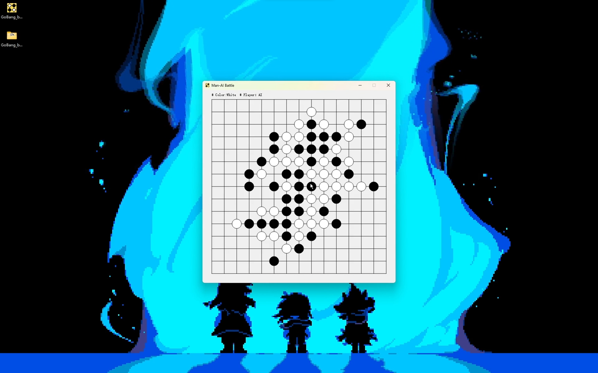

# Gobang_by_Temmie

 

# 简介

一个桌面五子棋应用程序，练习C++项目而做。基于 Qt 5.12 (C++ 11) 开发，AI 使用评分表法，虽然没有使用深搜，但在该评分表下，AI棋力仍可观。

 

# 体验

Windows平台可下载已发布的.exe文件，直接打开运行即可。

通过Qt打开源程序目录下的 GoBang_by_Temmie.pro 文件，直接编译运行即可。

操作：
- 主界面选择对战模式
- 落子：鼠标直接点击（待落子点有提示标记）
- 本地对战模式使用鼠标能完成全部操作
- 联网对战中需要输入服务器IP地址和端口号
- 服务器创建窗口标题是IPv4地址（如果有），能改变端口号

# 我学到了什么？

Qt的平台的基础操作，更多的有关多文件编程，网络编程和C++类编程的知识（这个程序仅是个练手的小项目）。

# 演示视频

- https://www.bilibili.com/video/BV1fs4y1r7XH
- https://youtu.be/Ela0xCwen9Q

# 更新
- BoardParams模块：棋盘和游戏参数
- GameCore模块：核心逻辑
- GameWindow模块：主界面
- LanBattle模块：联网对战界面
- NetServer模块：服务器创建界面
- ScoreEngine模块：评分表API
